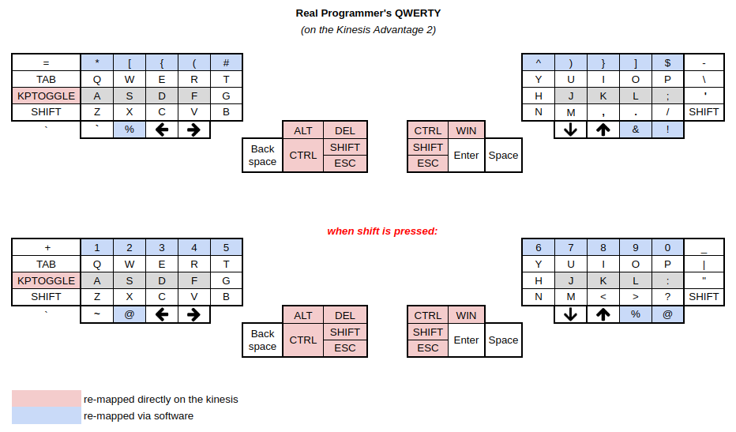

dotfiles

```bash
# add
stow [foldername]

# remove
stow -D [foldername]

# update
stow -D [foldername]
stow [foldername]
```

# Keyboard
I use remaps with xmodmap

```bash
xmodmap ~/.Xmodmap
```


